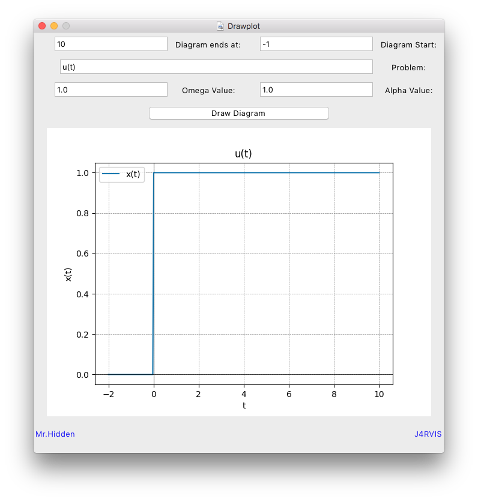
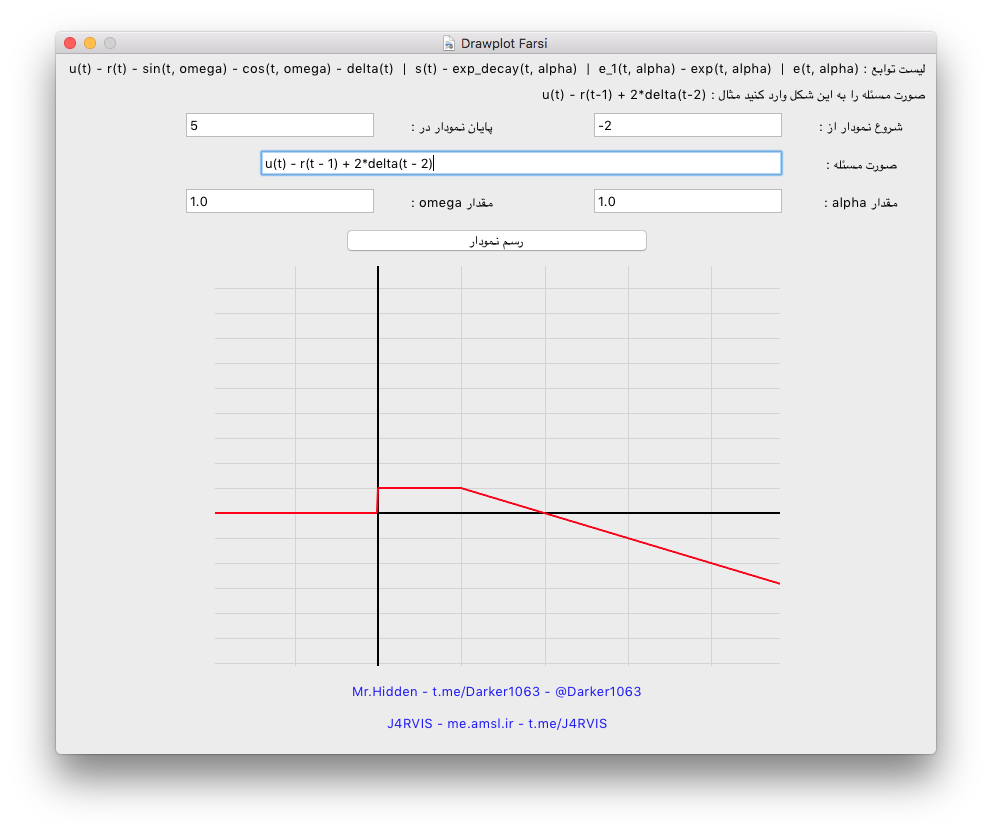
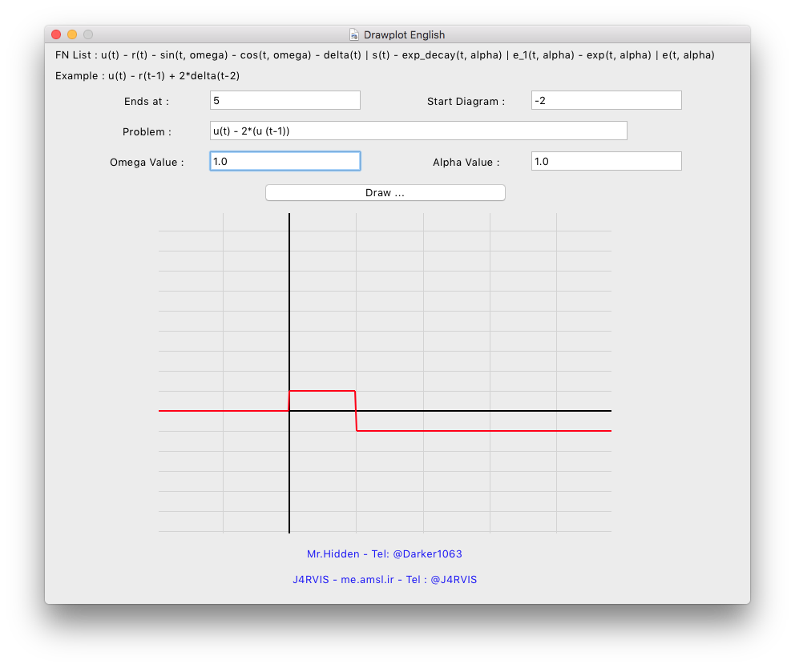
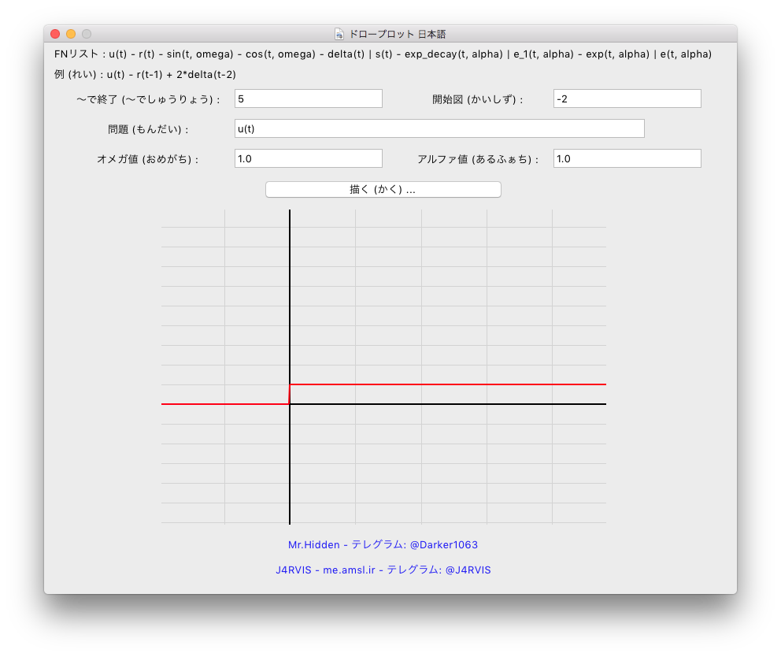
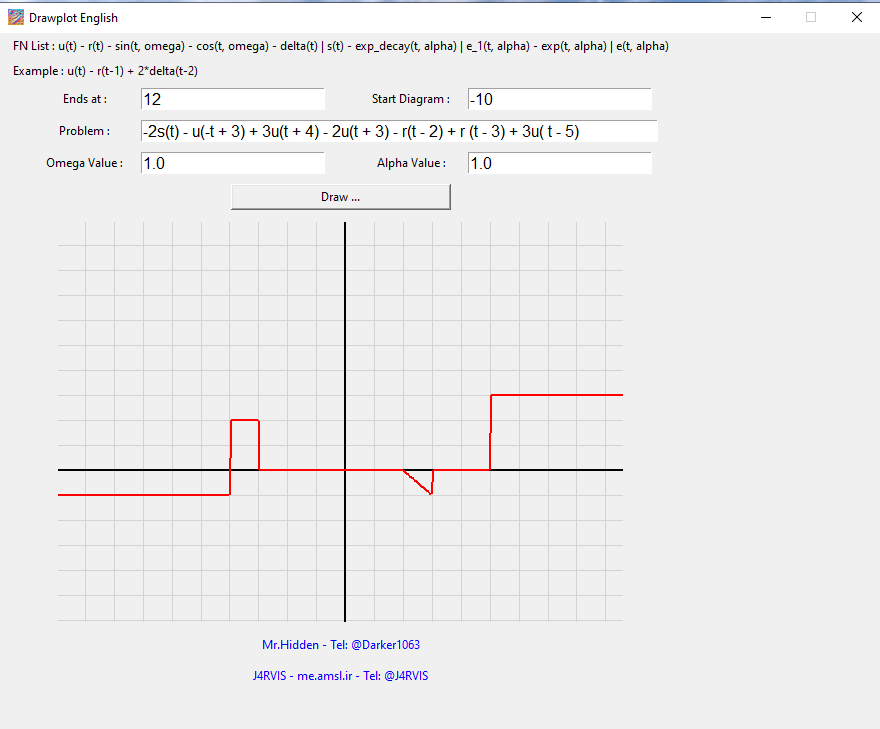
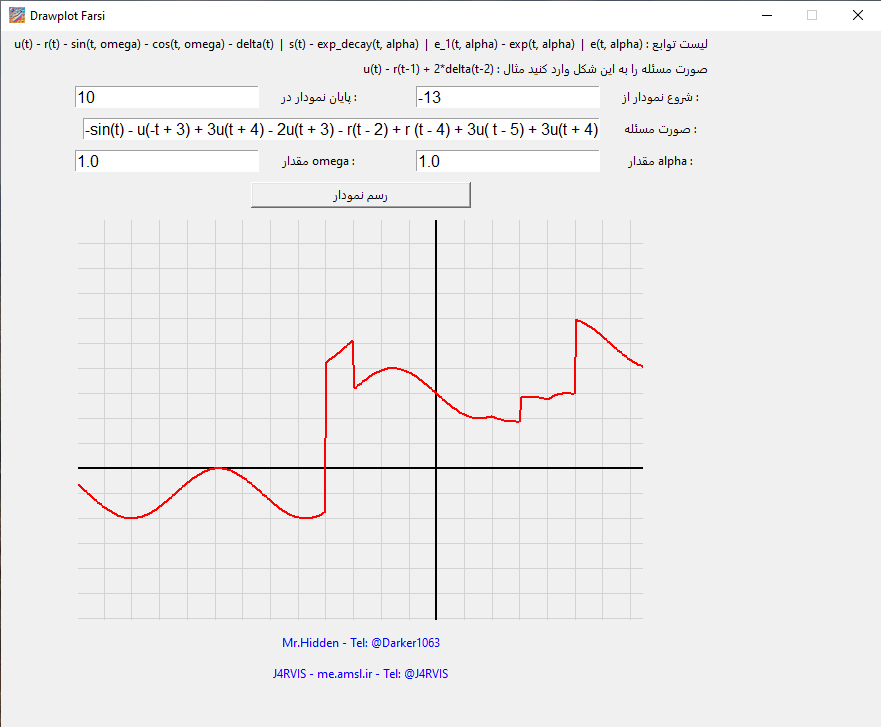

# drawplot-py
Drawing Plot for Signal &amp; System designs

We developed 2 version of this app

1. Numpy + Matplotlib App

2. No Dependency App

No differences in functionality tho in app size and speed of running there are much to say.

**RECOMMENDED is Second Version**

## Screenshot

### Version 1

##### macOS



##### Windows


---

### Version 2

##### macOS

Farsi Version



English Version



Japanese Version



##### Windows

Windows English Version



Windows Japanese Version


Windows Farsi Version



## Requirements for Version 1

- Python 3.13+
- Install pip and related packages

## Requirements for Version 2

- Nothing just a full python installation will satisfied

## Version 1 Powered 

- Matplotlib
- Numpy

## Download

You can use pre build macOS farsi version [here](https://github.com/JARVIS-AI/drawplot-py/releases/download/2.1.2/Drawplot_FA_macOS.app.zip)

If you want other versions and language just use source code and compile them by yourself

## How to compile version 2 (Recommended)

```bash
python3.13 -m venv .env

pip install -r requirements.txt

pyinstaller --onefile --windowed --icon=drawplot.ico --noconsole --strip --clean --name "Drawplot_FA_macOS" Graphity_fa.py

pyinstaller --onefile --windowed --icon=drawplot.ico --noconsole --strip --clean --name "Drawplot_EN_macOS" Graphity_en.py

pyinstaller --onefile --windowed --icon=drawplot.ico --noconsole --strip --clean --name "Drawplot_JP_macOS" Graphity_jp.py

on Windows just rename the --name "Drawplot_JP_Win"

Same goes on linux
```

## How to compile version 1

```bash
python3.13 -m venv .env

pip install -r requirements.txt

pyinstaller --onefile --windowed --icon=drawplot.ico --noconsole --strip --clean --name "Drawplot" drawplot.py
```

## Credit

- Windows developer : [Mr.Hidden](https://t.me/Darker1063)
- - [Github](https://github.com/hamid1021)
- macOS and Linux developer and CC: [J4RVIS](https://me.amsl.ir)
- - [GitHub](https://github.com/JARVIS-AI)

## Thanks

Many thanks to users - friends - teachers and who had helped us during development

Hope you have ejoy using this app and learn new things
